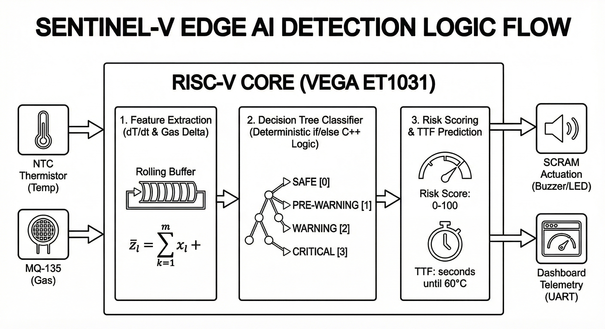

# Anomaly Detection & Edge AI Logic

SentinEL-V rejects standard, reactive thresholding (e.g., "Trigger alarm if Temp > 60°C"). Instead, it uses multi-modal predictive logic deployed at the edge.

### 1. Feature Extraction: Thermal Velocity ($dT/dt$)
Instead of measuring absolute heat, the system calculates the **Rate of Rise**. Using the 10-sample rolling buffer, the RISC-V core performs a real-time linear regression to calculate the slope of the temperature curve. This allows the system to detect runaway *acceleration* while the battery is still physically cool.

### 2. Decision Tree Classifier
The core AI is a Decision Tree Classifier trained using `scikit-learn` on synthetic EV runaway datasets. The trained tree is exported as deterministic `if/else` C++ logic for microsecond execution on the VEGA core.
* **Inputs:** `Rate_of_Rise` ($dT/dt$), `Gas_Delta` (VOC change), `Current_Temp`.
* **Classes:** `[0] SAFE`, `[1] PRE-WARNING`, `[2] WARNING`, `[3] CRITICAL`.
* **Fusion Logic:** If the MQ-135 detects a spike in chemical VOCs (simulating early electrolyte venting), the AI immediately overrides the thermal logic and jumps to a CRITICAL state, preventing reliance on a single point of failure.

### 3. Risk Scoring & Time-to-Failure (TTF)
* **Risk Score:** A continuous 0-100 metric calculated by combining the weighted values of $dT/dt$, absolute heat, and gas displacement. 
* **TTF Prediction:** If $dT/dt > 0$, the system extrapolates the current thermal velocity to predict exactly how many seconds remain before the cell hits the catastrophic 60°C threshold.