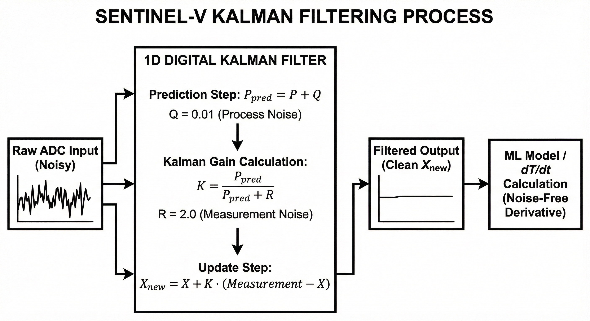

# Signal Conditioning & Kalman Filtering

Raw analog-to-digital (ADC) conversions inherently suffer from micro-voltage fluctuations and electromagnetic interference. To ensure the Machine Learning model is fed clean data, SentinEL-V implements a 1D Digital Kalman Filter.

### The Mathematics
Instead of simple rolling averages (which introduce severe phase-lag), the Kalman filter predicts the true state of the signal by minimizing the estimated error covariance. 

For each sensor, the system updates the state using:
$P_{pred} = P + Q$
$K = \frac{P_{pred}}{P_{pred} + R}$
$X_{new} = X + K \cdot (Measurement - X)$

### Parameters
* **Q (Process Noise Covariance):** Set to `0.01` for temperature. A lower value assumes the true physical temperature cannot jump instantaneously, providing heavy smoothing.
* **R (Measurement Noise Covariance):** Set to `2.0`. This defines our trust in the ADC hardware. 

By passing the raw NTC and MQ-135 data through this algorithm, the system achieves a perfectly flat signal baseline, ensuring the derivative calculations ($dT/dt$) are not triggered by hardware noise.