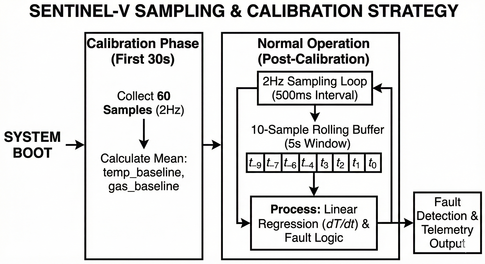

# Sampling Strategy

SentinEL-V utilizes a deterministic, low-latency sampling strategy optimized for Edge AI execution on the VSDSquadron Ultra.

### Frequency & Windowing
* **Sampling Rate:** The system operates at a hard-coded **2Hz (500ms intervals)**. This frequency ensures that the RISC-V core has ample clock cycles to perform floating-point Kalman filter mathematics without blocking the main thread.
* **Rolling History Buffer:** The system maintains a localized array of the last 10 temperature samples (representing a 5-second sliding window). This window is strictly used for calculating the linear regression required for thermal velocity.

### Adaptive Baseline Calibration
To prevent false positives caused by differing ambient environments, SentinEL-V runs a 30-second calibration phase upon boot.
* **First 60 Samples:** The system collects sensor data without evaluating fault logic.
* **Baseline Anchoring:** It calculates the mathematical mean of both the environmental temperature and the ambient Air Quality/VOC levels, establishing them as `temp_baseline` and `gas_baseline`.