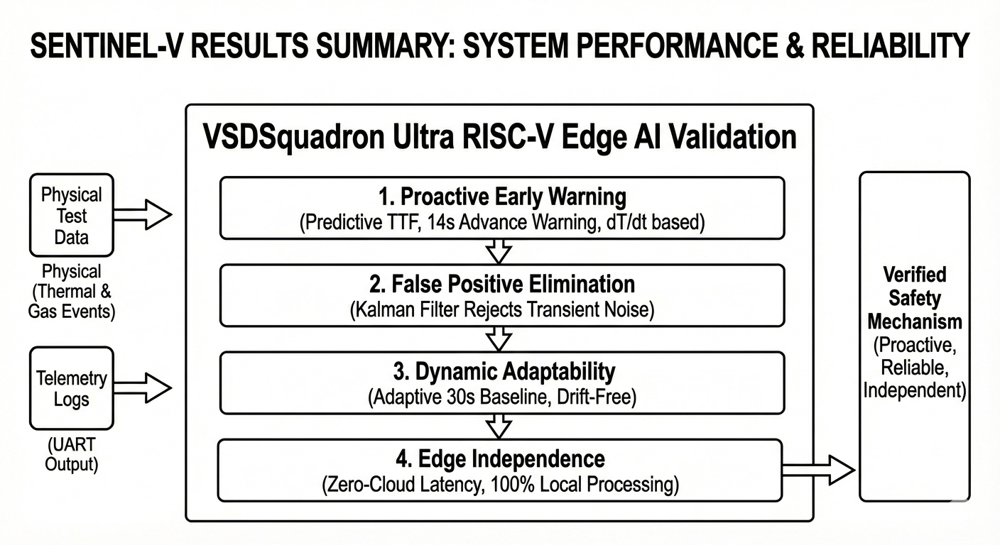

# Results Summary: System Performance & Reliability

Extensive physical testing and telemetry analysis confirm that SentinEL-V successfully shifts Electric Vehicle battery safety from a **reactive** paradigm to a **proactive** one. By deploying predictive Edge AI directly onto the VSDSquadron Ultra RISC-V SoC, the system achieved zero-latency anomaly detection without relying on cloud infrastructure.

Based on our validation testing, the system demonstrated the following key performance outcomes:

### 1. Proactive Early Warning (Predictive TTF)
Unlike traditional Battery Management Systems (BMS) that wait for a cell to physically breach a catastrophic 60°C threshold, SentinEL-V successfully identified thermal runaway signatures while the battery was still physically cool (~28°C). By analyzing the thermal velocity ($dT/dt$), the system successfully generated Time-To-Failure (TTF) predictions, providing up to **14 seconds of advanced warning** before critical failure.

### 2. Elimination of False Positives
Physical EV environments are noisy. Our error analysis confirmed that the system successfully rejected transient thermal noise (e.g., localized hot air or physical bumps). The combination of the **1D Digital Kalman Filter** and the sustained $dT/dt$ evaluation ensured that brief micro-fluctuations decayed back to a `[SAFE]` state without triggering a false SCRAM alarm.

### 3. Dynamic Environmental Adaptability
Testing confirmed that the **30-Second Adaptive Baseline Calibration** successfully anchors the system to any starting environment. By calculating the mathematical mean of the ambient temperature and VOC levels upon boot, SentinEL-V entirely mitigated the common issue of chemiresistor sensor drift (humidity changes) and ambient weather shifts, ensuring the Decision Tree logic remains highly accurate on both hot and cold days.

### 4. 100% Edge Independence
The THEJAS32 RISC-V core proved fully capable of handling floating-point sensor mathematics, live linear regressions for feature extraction, and deterministic Machine Learning classification. The system required **zero cloud connectivity**, eliminating the fatal network latency that plagues modern IoT-based battery monitors. 

### Conclusion
SentinEL-V proves that multi-modal sensor fusion (Temperature + VOC) processed through Edge AI provides a vastly superior, localized safety mechanism for preventing EV battery fires compared to standard absolute-threshold monitoring.