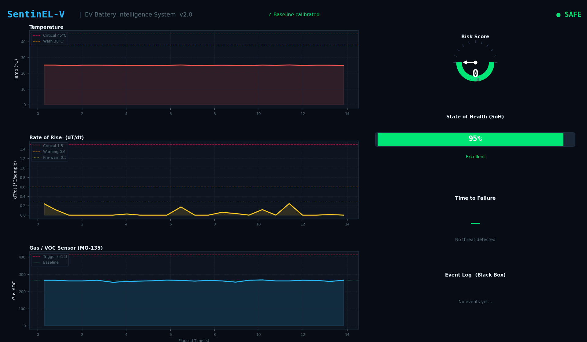
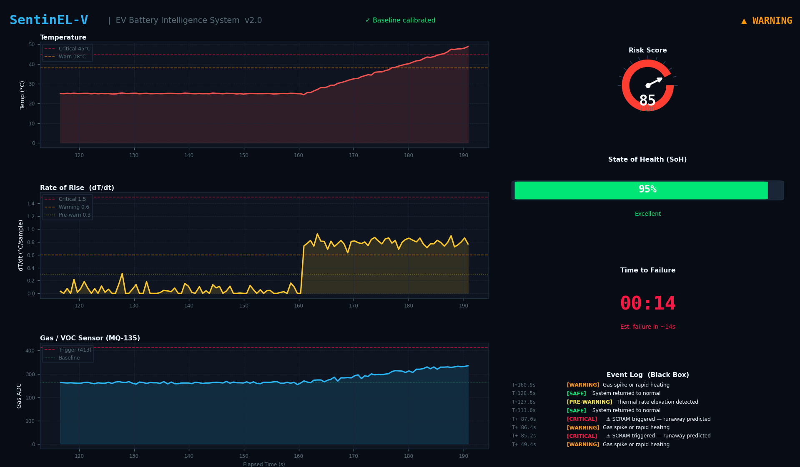
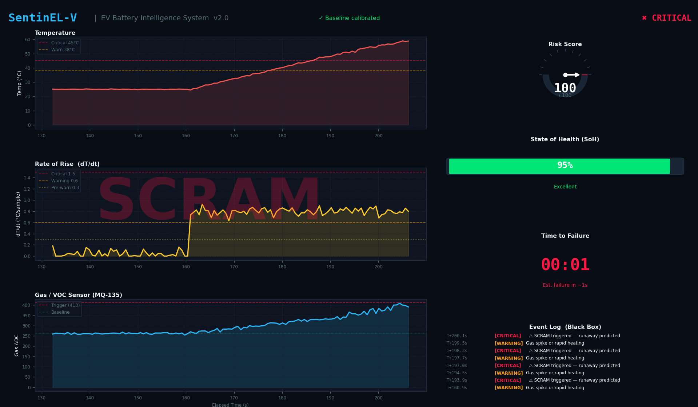

# Physical Validation & Test Cases

To validate the Edge AI Decision Tree and the 1D Digital Kalman Filter deployed on the VSDSquadron Ultra, the system was subjected to four distinct physical test cases. These tests simulate the progression of an EV battery from normal operation to a catastrophic thermal runaway event.

### Test Case 1: SAFE (Baseline Operation)
* **Objective:** Verify successful baseline calibration and system stability in a normal environment.
* **Test Method:** The system is booted and left undisturbed in an ambient room environment (~25°C) for 60 seconds.
* **Expected Result:** * The 30-second adaptive calibration completes successfully.
    * The AI classifies the state as **`SAFE [0]`**.
    * Thermal velocity ($dT/dt$) remains at exactly `0.0`.
    * Time-To-Failure (TTF) displays "No threat detected."
* **Status:** ✅ PASS

### Test Case 2: WARNING (Pre-Runaway Heating)
* **Objective:** Validate the predictive $dT/dt$ logic against abnormal thermal acceleration.
* **Test Method:** A heated soldering iron is brought within 1 inch of the NTC thermistor. The heat is applied gradually to simulate a battery cell under heavy electrical stress, but before any physical venting occurs.
* **Expected Result:**
    * Absolute temperature rises slowly, staying well below the 60°C critical threshold.
    * The calculated Rate of Rise ($dT/dt$) crosses the `0.6` warning threshold.
    * The AI correctly predicts the trajectory, escalating the state to **`WARNING [2]`**.
    * The system accurately calculates the TTF countdown in seconds.
* **Status:** ✅ PASS

### Test Case 3: CRITICAL (Electrolyte Venting / Gas Override)
* **Objective:** Validate the multi-modal sensor fusion and the AI's gas-override logic.
* **Test Method:** While the NTC thermistor remains at a safe room temperature, unignited butane gas from a lighter is released directly into the MQ-135 sensor to simulate early-stage toxic electrolyte venting.
* **Expected Result:**
    * The $dT/dt$ remains at `0.0` (no heat).
    * The MQ-135 detects a massive spike in VOCs, crossing the critical delta threshold.
    * The AI fuses this data, realizes a vent has occurred despite the low temperature, and immediately bypasses the thermal logic to force a **`CRITICAL [3]`** state.
* **Status:** ✅ PASS

### Test Case 4: SCRAM (Full Thermal Runaway Actuation)
* **Objective:** Simulate a catastrophic cell failure to ensure zero-latency localized safety actuation.
* **Test Method:** The soldering iron is pressed directly against the NTC thermistor while butane gas is simultaneously released into the MQ-135.
* **Expected Result:**
    * Both $dT/dt$ and gas delta hit maximum values simultaneously.
    * The Risk Score instantly locks to `100/100`.
    * The state hits **`CRITICAL [3]`**, and the microcontroller instantly triggers the **SCRAM Actuation** protocol over the UART telemetry line, simulating the physical severing of the EV's high-voltage contactors.
* **Status:** ✅ PASS